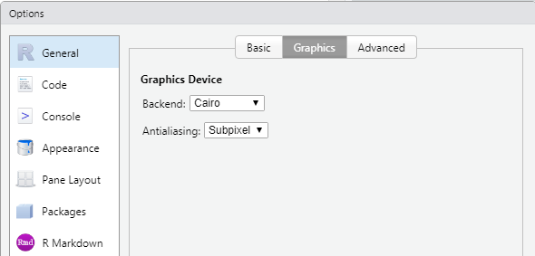

## Sissejuhatus

Siin praktikumis jätkame ggplot2 võimaluste õppimisega. Selleks, et tööga pihta saaks hakata, loeme sisse vajalikud paketid ja andmestiku.

```{r}
library(ggplot2)
library(tidyverse)

load("linnad.RData", verbose = T)
```

## Faktoritega töötamine

Pakett ggplot2 üritab võimalikult palju kasutada joonistamisel informatsiooni mis on kodeeritud faktori tasemetesse. Faktor on andmetüüp diskreetsetele muutujatele, mis säilitab lisaks väärtustele ka info küigi võimalike väärtuste ning nende järjestuste kohta. Faktori taseme nimede põhjal joonistatakse näiteks legend ja taseme järjestust kasutatakse telgedel elementide järjestamiseks. Seetõttu on oluline tunda paari nippi kuidas faktorite tasemetega töötada. 

Esiteks on kasulik panna faktori tasemetele sisukad nimed. Seda saab teha andes käsule `factor` ette juba sisukate nimedega sõnevektori, kasutades argumenti `labels`.

```{r}
a = factor(c(1, 1, 1, 2, 2, 3), labels = c("A", "B", "C"))
a
```

Faktori tasemete nimesid saab muuta kasutades käsku `fct_recode` (tuleb kaasa `tidyverse` paketiga). Sellega saab ka faktori tasemeid kokku võtta.

```{r}
fct_recode(a, "I" = "A", "II" = "B", "III" = "C")

fct_recode(a, "I" = "A", "II" = "B")

fct_recode(a, "I" = "A", "II" = "B", "I" = "C")
```

Faktori tasemete järjestust saab muuta ka käsuga `fct_relevel`, kus etteantud tasemed tõstetakse jäjekorras ette poole

```{r}
a = factor(c(1, 1, 1, 2, 2, 3), labels = c("A", "B", "C"))
a

fct_relevel(a, "C")
fct_relevel(a, "C", "B", "A")
```

Kui me tahame muuta faktorite järjekorda mingi teise vektori järgi, siis saab kasutada käsku `fct_reorder`.

```{r}
a = factor(c(1, 1, 1, 2, 2, 3), labels = c("A", "B", "C"))
b = c(1, 5, 6, 2, -4, 10)
a
b

fct_reorder(a, b)
fct_reorder(a, b, .desc = T)
fct_reorder(a, b, .fun = max)

```

Seega kui me tahame mugandada pilti on tihtipeale kasulikum enne mugandada andmeid ja siis nendega pilt joonistada.

```{r}
ggplot(linnad, aes(x = per_capita_inc, y = unemployment_rate, colour = income_class)) +
  geom_point() 

linnad %>% 
  mutate(income_class = fct_recode(income_class, "High" = "Very High", "Low" = "Very Low", "Low" = "Medium")) %>% 
  ggplot(aes(x = per_capita_inc, y = unemployment_rate, colour = income_class)) +
    geom_point() 
```

```{r}
ggplot(linnad, aes(x = per_capita_inc, y = unemployment_rate, colour = Poverty_factor)) +
  geom_point() 

linnad %>% 
  mutate(Poverty_factor = fct_relevel(Poverty_factor, "Low", "Medium", "High")) %>% 
  ggplot(aes(x = per_capita_inc, y = unemployment_rate, colour = Poverty_factor)) +
  geom_point() 
```

```{r}
ggplot(linnad, aes(x = County, y = pop_estimate)) +
  geom_bar(stat = "identity") 

linnad %>% 
  mutate(County = fct_reorder(County, pop_estimate)) %>% 
  ggplot(aes(x = County, y = pop_estimate)) +
    geom_bar(stat = "identity") 
```

#### Ülesanded

-   Joonistage seos *bachelor* ja *high_scl* vahel ning näidake värviga tunnust *income_class* . Võta koku klassid "Very Low" ja "Low" ning uuda värvide järjekord nii, et see algaks väga kõrgest ja lõppeks madalaga.

```{r}

linnad %>% 
  mutate(income_class = fct_recode(income_class, "Low" = "Very Low")) %>%
  mutate(income_class = fct_relevel(income_class, "Low", "Medium", "High", "Very High" )) %>% 
  ggplot(aes(x = bachelor , y = high_scl , colour = income_class )) +
  geom_point() 
```

## Graafikute annoteerimine ja mugandamine

### Graafikute annoteerimine

Telgede ja graafiku annoteerimise viise me oleme juba töö käigus näinud. Paljud asjad saab ära lahendada erinevate skaleerimisfunktsioonide parameetritega. Siiski on paljudele neis olemas ka mugavamad vasted eraldi funktsioonidega mis hoiavad trükkimist kokku. Neist olulisemad on 

-   `ggtitle()` - määrame graafiku pealkirja

-   `xlab()`, `ylab()` - telgede pealkirjad

-   `xlim()`, `ylim()` - telgede väärtusvahemiku määramine

### Graafikute stiil

Vahest on vaja muuta `ggplot2` graafikute üleüldist stiili või mõne elemendi väljanägemist. Näiteks on standardne `ggplot2` graafikute taust hall, mis ei ole alati parim lahendus. Seda on lihtne muuta käsuga `theme_bw` mis teeb tausta valgeks ja muudab ka portsu muude graafiku elementide värve ja kuju.

```{r}
ggplot(linnad, aes(x = per_capita_inc, y = unemployment_rate, colour = birth_class)) +
  geom_point() +
  theme_bw() 
```

Neid funktsioone on veel, tasub vaadata mida RStudio pakub, kui kirjutada algus `theme_` . Veel rohkem erinevaid teemasid on olemas paketis `ggthemes` (<https://yutannihilation.github.io/allYourFigureAreBelongToUs/ggthemes/>).

```{r}
library(ggthemes)
ggplot(linnad, aes(x = per_capita_inc, y = unemployment_rate, colour = birth_class)) +
  geom_point() +
  theme_wsj() 
```

Täpsemalt saab muuta konkreetseid elemente käsuga `theme`. Siin on terve ports parameetreid mis töötavad hierarhiliselt. Olulisemad on toodud järgmisel joonisel.

](images/Screenshot%202021-02-22%20at%2010.54.18.png)

Nendele saabväärtuseks anda käske `element_text`, `element_line` ja `element_rect` vastavalt parameetri tüübile. Käskude `element_*` parameetrid vastavad suhteliselt täpselt sarnaste elementide grid paketis kasutatavatele parameetritele. Oluline funktsioon on ka element_blank mis vastava elemendi lihtsalt ära kustutab.

```{r}
ggplot(linnad, aes(x = per_capita_inc, y = unemployment_rate, colour = birth_class)) +
  geom_point() +
  theme(panel.background = element_rect(fill = "pink"), panel.grid.minor = element_blank())
```

Väga oluline parameeter käsus theme on ka `legend.position`. Kui selle väärtuseks on `"none"` kustutatakse legend ära. Väärtused `"left"`, `"right"`, `"top"` ja `"bottom"` käituvad nagu võiks oodata . Andes ette kahe elemendilise vektori paigutab ta legendi graafiku ala sees vastavalt antud koordinaatidele, paralleelselt on hea kasutada ka `legend.justification` argumenti, mis võimaldab legendi paigutust täpsemalt kontollida.

```{r}
ggplot(linnad, aes(x = per_capita_inc, y = unemployment_rate, colour = birth_class)) +
  geom_point() +
  theme(legend.position = "none")
```

```{r}
ggplot(linnad, aes(x = per_capita_inc, y = unemployment_rate, colour = birth_class)) +
  geom_point() +
  theme(legend.position = "bottom")
```

```{r}
ggplot(linnad, aes(x = per_capita_inc, y = unemployment_rate, colour = birth_class)) +
  geom_point() +
  theme(legend.position = c(1,1), legend.justification = c(1, 1))
```

#### Ülesanded

-   Proovi saavutada umbes järgmine pilt.


```{r}
ggplot(linnad, aes(x = bachelor, y = high_scl, colour = income_class)) +
  geom_point() +
  scale_color_brewer(type="div", palette=2) +
  ggtitle("High School and Higher Education") +
  theme(
    panel.background = element_rect(fill = "gold"),
    axis.text.x = element_text(angle=45),
    legend.position = c(1,0), 
    legend.justification = c(1, 0),
    legend.background = element_rect(color = "black"),
    legend.key = element_rect(fill = "grey95")
  )
```

## Graafikute salvestamine

Grafikuid saab salvestada käsuga `ggsave()`, Kui ette anda vaid faili nimi, siis salvestab see käsk viimase graafiku, mis sai joonistatud, kusjuures suuruse võtab ta akna järgi ning failitüübi määrab faili nime laiendi järgi.

Parameetreid `width` ja `height` kasutades on võimalik ära määrata ka täpselt joonise mõõdud (tollides).

```{r}
ggplot(linnad, aes(x = per_capita_inc, y = unemployment_rate, colour = Poverty_factor)) +
  geom_point() +
  theme(legend.position = c(1,1), legend.justification = c(1, 1))

ggsave("plot1.png")
ggsave("plot1.pdf")
ggsave("plot1_wide.png", width = 10, height = 5)
```

Soovitav on salvestada jooniseid .pdf formaadis. Nii tehakse vektorgraafika ja pilt on alati hea kvaliteediga. Kui soovida (Windowsil), et kas raster kujul salvestatud pildid näiteks .png failid head välja näeksid tasub muuta vaikimisi graafika mootorit RStudios järgnevalt.



## Erinevate graafikute kokku panemine

Graafikute tahkudeks jagamine toimib väga hästi, kui me tahame ühte tüüpi graafikut jagada mitmeks. Kuid kui me tahame erinevat tüüpi graafikuid erinevatel muutujatel samal pildil kõrvuti näidata, siis sama lähenemine ei tööta. Siin tulevad appi lisapaketid. Näiteks `patchwork` on üks mis võimaldab `ggplot2` graafikuid kokku panna.

Enne, kui läheme `patchwork`-i enda juurde vaatame ühte kasulikku nippi. Nimelt on võimalik ggplot graafik muutujana salvetada. Joonistatakse see alles siis kui muutuja väärtus on vaja välja trükkida.

```{r}
p = ggplot(linnad, aes(x = per_capita_inc, y = unemployment_rate, colour = Poverty_factor)) +
  geom_point()

p
p + theme_bw()
```

Loeme sisse paketi patchwork ja defineerime kolm graafikut mida kombineerima hakata.

```{r}
install.packages("patchwork")
```

```{r}
library(patchwork)

p1 = ggplot(linnad, aes(x = per_capita_inc)) +
  geom_histogram() +
  ggtitle("Plot 1")
p2 = ggplot(linnad, aes(x = per_capita_inc, y = unemployment_rate, colour = Poverty_factor)) +
  geom_point() +
  ggtitle("Plot 2")
p3 = ggplot(linnad, aes(x = State, y = unemployment_rate, fill = State)) +
  geom_boxplot() +
  ggtitle("Plot 3")


p1
p2
p3
```

Patchworkis tehakse ka graafikutega "tehteid". Selleks, et graafikuid kõrvuti panna on tehe `|`.

```{r}
p1 | p2  
```

Üksteise alla saab panna graafikuid tehtega `/` .

```{r}
p1/p2
```

Tehteid saab ka kombineerida, siis tuleb tähelepanu juhtida tehete järjekorrale

```{r}
p1 | p2 / p3
```

```{r}
(p1 | p2) / p3
```

Selleks, et piltide paigutust paremini kontrollida on funktsioon `plot_layout`, millega saab joonise erinevaid aspekte muuta. Näiteks `heights` parameeter võimaldab muuta piltide suhtelisi kõrguseid.

```{r}
p1 / p2 / p3 + plot_layout(heights = c(2, 2, 4))
```

Argument widths töötab sama moodi.

```{r}
(p1 | p2 | p3) + plot_layout(widths = c(2, 2, 4))
```

Eelmine pilt jäi kole sest vastavate laiustega on graafikute andmeid näitavad paneelid. Kuna kahel graafikul on aga legend, siis nende laiust arvesse ei võeta. Küll aga on võimalik argumendiga guides kõikidelt piltidelt legendid kokku koguda.

```{r}
(p1 | p2 | p3) + plot_layout(widths = c(2, 2, 4), guides = "collect")
```

Paketis patchwork on veel palju võimalusi ja tasub uurida paketi kodulehte <https://github.com/thomasp85/patchwork> ja seal viidatud õpetusi.

#### Ülesanded

-   Proovige tekitada järgnev pilt


```{r}
(p1 / ( p2 | p3)) + plot_layout(widths = c(2, 2, 4), guides = "collect")
```

## Kodune ülesanne

-   Proovi joonistada võimalikult sarnane graafik järgnevaga. Siin on rakendatud terve hulk nippe, mida sai selles ja eelmises praksis õpitud. Punktid kujunevad selle põhjal kui palju neist nippidest on rakendatud. Kui õiget nippi on rakendatud, kuid tulemus pole täpselt identne, siis punkte maha ei võta. Näiteks kui värv pole täpselt õige aga õigel graafiku osal on seda siiski muudetud.

    

```{r}
linnad
```

```{r}
library(ggplot2)
library(dplyr)
library(patchwork)


fill_cols <- c(
  "Low"    = "#f4a142",
  "Medium" = "gray90",
  "High"   = "#7b67c8"
)

outline_cols <- c(
  "Low"    = "#e65000",
  "Medium" = "#e65000",
  "High"   = "#e65000"
)


data <- linnad %>% 
  mutate(
    income_class = fct_recode(income_class, "High" = "Very High", "Low" = "Very Low"),
    Poverty_factor = fct_relevel(Poverty_factor, "Low", "Medium", "High"),
    Birth_factor = fct_relevel(Birth_factor, "Low", "Medium", "High") 
  )

p1 <- ggplot(data, aes(x = Birth_factor, y = over65, fill = Birth_factor)) + 
    geom_boxplot(fill = NA, color="gray5") +
    geom_violin(
      aes(color = Birth_factor),
     alpha = 0.4, linewidth = 0,
      draw_quantiles = NULL
    ) +
    scale_fill_manual(values = fill_cols) +
    scale_color_manual(values = outline_cols) +
    geom_hline(yintercept = 12.5, linetype = "dotted") +
    facet_wrap(~ State, ncol = 3) + 
    theme_bw(base_size = 13) +
    theme(
      strip.background = element_rect(fill = "#f2b0c4", color = "black"),
      strip.text = element_text(face = "bold"),
      panel.grid.major.x = element_blank(),
      panel.grid.major.y = element_blank(),
      panel.grid.minor = element_blank(),
      panel.background = element_rect(fill = "white", color = NA),
      legend.position = c(1, -0.1), 
      legend.justification = c(1, 0),
      legend.key = element_rect( color="red"),
    ) 


p2 <- ggplot(linnad, aes(x = deaths, y = births)) +
  geom_point(color = "white", size = 2,) +
  geom_smooth(color = "red", linewidth = 1) +
  theme_void() +
  theme(
    panel.background = element_rect(fill = "black", color = "black"),
    panel.grid.major = element_line(color = "white", linetype = "dashed"),
    panel.grid.minor = element_line(color = "white", linetype = "dashed"),
    axis.text = element_text(color = "black"),
    axis.title = element_text(color = "black"),
    plot.background = element_rect(fill = "white", color = "white"),
    axis.title.y = element_text(angle = 90)
  ) +
    scale_x_continuous(name = "Higher education percentage", breaks = c(0, 0.5, 1, 1.5, 2))+
  labs(x = "deaths", y = "births")


p1 / p2 + plot_layout(heights = c(3, 1))
```

## ggplot2-ga graafikute joonistamise harjutamine

Selle ja eelmise praktikumi põhjal peaks olulisemad oskused ggplot2 kasutamiseks olemas olema. Nüüd proovime neid rakendada, kasutades ka teadmisi teisest loengust, kus sai tutvustatud graafikute valimise põhimõtteid täpsemalt.

Loeme sisse kõigepealt andmestiku, mis kirjeldab siis 2000 inimese kehamassi indekseid ja juhuslikul päeval tehtud sammude arvu. Iga inimese kohta on ka antud sugu, vanus ja vanusegrupp. Loeme andmestiku sisse.

```{r}
load("bmi.RData", verbose = T)

bmi
```

Iga ülesande puhul tasub proovida erinevaid variante ja mõelda milline töötab antud olukorras paremini ja miks. Meeldetuletuseks, siin on olulisemad käsud mida vaja võib minna

-   `geom_point`

-   `geom_histogram`

-   `geom_bar`

-   `geom_boxplot`

-   `geom_density`

-   `geom_violin`

-   `geom_smooth`

-   `facet_grid`

#### Ülesanded

-   1 Milline tehtud sammude jaotus? Millist geomeetrilist esitust võib selle uurimiseks kasutada?

-   2 Milline on tehtud sammude jaotus sugude kaupa? Vihjed:

    -   et joonistada histogrammid üksteise peale tasub panna `position = "identity"`

    -   argument `alpha` kontrollib värvide läbipaistvust

-   3 Kumma soo esindajad teevad mediaanis vähem sammusid?

-   4 Tee läbi see sama võrdlus vanusegruppide kaupa. Kas järeldus on sama?

-   5 Vaata vanusegruppide arvukust sugude kaupa. Kas jaotus on sarnane või erinev?

-   6 Kas vanuse ja tehtud sammude vahel on seos? Kas seos tundub lineaarne?

-   7 Milline on seos kehamassi indeksi ja sammude vahel? Kas seos on lineaarne ja või on tegu millegi keerukamaga?

```{r}

#1
ggplot(bmi, aes(x = Steps)) +
  geom_histogram()

ggplot(bmi, aes(x = Steps)) +
  geom_histogram(bins = 100)

ggplot(bmi, aes(x = Steps)) +
  geom_density()

ggplot(bmi, aes(x = Steps)) +
  geom_boxplot()
```

```{r}

#2
ggplot(bmi, aes(x = Steps, fill=Gender)) +
    geom_histogram(position = "identity", alpha=0.3)

ggplot(bmi, aes(x = Steps, fill=Gender, color=Gender)) +
    geom_histogram(position = "identity", alpha=0.3)


ggplot(bmi, aes(x = Steps, fill=Gender, color=Gender)) +
  geom_density(position = "identity", alpha=0.3)

```

```{r}

#3

ggplot(bmi, aes(x = Steps, y=Gender)) +
  geom_boxplot()

```

```{r}

#4
ggplot(bmi, aes(x = Steps, y=AgeGroup, fill=Gender)) +
  geom_boxplot()
```

```{r}

#5
ggplot(bmi, aes(x = Gender, fill=AgeGroup)) +
  geom_bar()

ggplot(bmi, aes(x = Gender, fill=AgeGroup)) +
  geom_bar(position="dodge")

ggplot(bmi, aes(x = Gender, fill=AgeGroup)) +
  geom_bar(position="fill")
```

```{r}

#6
ggplot(bmi, aes(x = Age, y=Steps)) +
  geom_point() +
  geom_smooth()

ggplot(bmi, aes(x = Age, y=Steps)) +
  geom_point() +
  geom_smooth(method = "lm")
```

```{r}

#7 
ggplot(bmi, aes(x = BMI, y=Steps)) +
  geom_point() +
  geom_smooth()

ggplot(bmi, aes(y = BMI, x=Steps)) +
  geom_point() +
  geom_smooth(method = "lm")
```

## Kodune ülesanne

Failis `ylevaatused.RData` on andmestik kõigi Eestis toime pandud sõidukite tehniliste ülevaatuste kohta. Tunnuste kohta lisainfot palju pole, kuid nimed peaks suht selged olema. Andmestik pärineb eesti avaandmete portaalist: <https://avaandmed.eesti.ee/datasets/maismaasoidukite-tehnoulevaatused-eestis>

Ülesandeks on selle andmestiku põhjal joonistada välja graafik mis toob välja mingi huvitava seose. Andmestik on suur ja graafik ei pea kajastama tervet andmestikku, vaid võib keskenduda mingile andmete alamhulgale.

Sellel graafikul võib olla mitu paneeli, kuid peab olema siiski **üks** fail, mis välja trükkides mahuks ühele lehele ja oleks loetav. Kuna andmed on keerukad võib pildi salvestada suuremana, kui Rstudio graafiku aknasse mahub (kasutades käsku `ggsave` ja argumente `height` ja `width`), et kõigel vajalikul piisavalt ruumi oleks.

Esitada tuleb graafikut genereeriv **kood**, põhjendus miks just antud tüüpi graafik(ud) on nende andmete näitamiseks hea ja ka mõne lauseline **järeldus**, mille te pildilt olete välja lugenud.

Graafik peab vastama järgnevatele tingimustele.

-   Kasutatud on vähemalt 5 erinevat tunnust

-   Kasutatud on vähemalt 2 erinevat geom\_\* funktsiooni

-   On modifitseeritud graafiku elementide väljanägemist ning need muudatused on asjakohased

-   On valitud andmetele sobiv visualiseerimise meetod

-   Graafik ei vaja lisaselgitusi ning on kergesti loetav (kõik tekstid suurte algustähtedega, grammatiliselt korrektsed, piisavalt kirjeldavad).

-   Tekstilised järeldused ja graafik lähevad kokku.

```{r}

load("ylevaatused.RData", verbose = T)

ylevaatused
```

```{r}
names(ylevaatused) # colnames(ylevaatused)


unique(ylevaatused$YLEVAATUSOTSUS)


str(ylevaatused)
```

```{r}
library(tidyverse)
library(patchwork)
```

```{r}
ylev <- ylevaatused %>%
  mutate(
    RIKKED = ifelse(is.na(RIKKED), "", RIKKED),
    VIGADE_ARV = ifelse(RIKKED == "", 0, str_count(RIKKED, ";") + 1),
  ) %>%
  filter(str_starts(KATEGOORIA, "M") & !is.na(KATEGOORIA)) %>%
 mutate(KERETYYP_GRUPP = case_when(
    KERETYYP %in% c("MAHTUNIVERSAAL", "UNIVERSAAL", "LUUKPÄRA", "SEDAAN",
                    "KUPEE", "LIMUSIIN", "KOMBI") ~ "Sõiduauto",

    KERETYYP %in% c("LAHTINE", "PIKAP", 
                    "SIHTOTSTARBELINE", "ERIOTSTARBELINE SÕIDUK") ~ "Kaubik / tööauto",

    KERETYYP %in% c("MITMEOTSTARBELINE SÕIDUK") ~ "Mitmeotstarbeline",

    KERETYYP %in% c("BUSS", "LIIGENDBUSS", "KORRUSBUSS", "TROLL") ~ "Buss",

    KERETYYP %in% c("KIIRABI", "MATUSEAUTO", "ELAMU") ~ "Erisõiduk",

    TRUE ~ NA
  ))
  #sample_n(20000)

ylev
```

```{r}
#unique(ylev$YLEVAATUSOTSUS)

unique(ylev$KERETYYP)
```

```{r}
# Vanus vs mitte_positiivne ülevaatusotsus (M1 ja m1g kategooria (sõiduuatod ja bussid))

library(scales)
palett = hue_pal()(8)

kategooria_värvid = c(
  "M1"     = palett[2],
  "M1G"    = palett[4],
  "M2"     = palett[6],
  "M3"     = palett[8]
)


m1_m1g <- ylev %>%
  filter(!is.na(ESMANE_REG_AASTA), !is.na(YLEVAATUSOTSUS)) %>%
  filter(YLEVAATUSOTSUS %in% c("EI_VASTA_NOUETELE", "SOITMISEKS_KOLBMATU")) %>%
  filter(KATEGOORIA %in% c("M1", "M1G")) %>%
  ggplot(aes(x = ESMANE_REG_AASTA, color = KATEGOORIA, fill = KATEGOORIA)) +
  geom_density(alpha = 0.2) +
  labs(
    title = "Sõiduautod",
    x = "Esmane registreerimse aasta",
    y = "Tihedus",
    fill = "Kategooria",
    color = "Kategooria"
  ) +
  theme_minimal(base_size = 12) +
  theme(plot.title = element_text(face = "plain", size = 12)) +
  scale_color_manual(values = kategooria_värvid) +
  scale_fill_manual(values = kategooria_värvid) 

m2_m3 <- ylev %>%
  filter(!is.na(ESMANE_REG_AASTA), !is.na(YLEVAATUSOTSUS)) %>%
  filter(YLEVAATUSOTSUS %in% c("EI_VASTA_NOUETELE", "SOITMISEKS_KOLBMATU")) %>%
  filter(KATEGOORIA %in% c("M2", "M3")) %>%
  ggplot(aes(x = ESMANE_REG_AASTA, color = KATEGOORIA, fill = KATEGOORIA)) +
  geom_density(alpha = 0.2) +
  labs(
    title = "Bussid",
    x = "Esmane registreerimse aasta",
    y = "Tihedus",
    fill = "Kategooria",
    color = "Kategooria"
  ) +
  theme_minimal(base_size = 12) +
  theme(plot.title = element_text(face = "plain", size = 12)) +
  scale_color_manual(values = kategooria_värvid) +
  scale_fill_manual(values = kategooria_värvid) 


graafik1 <- m1_m1g / m2_m3 +
   plot_layout(guides = "collect") +
   plot_annotation(
    title = "Negatiivne ülevaatusotsus",
    subtitle = "M-kategooria sõidukid",
    #caption = "Allikas: ?? trust me bro",
    theme = theme(
      plot.title = element_text(face = "bold", size = 16),
      plot.subtitle = element_text(size = 12)
    )
  ) 

#graafik1
```

```{r}


# Auto kategooria ja vigade arv
graafik2 <- ylev %>%
  filter(!is.na(KATEGOORIA), !is.na(KERETYYP_GRUPP)) %>%
  group_by(KATEGOORIA) %>%
  ggplot(aes(y = KATEGOORIA, x = VIGADE_ARV, color=KERETYYP_GRUPP)) +
  geom_point(position = "jitter") +
  labs(
    title = "Vigade arv keretüübi kohta",
    subtitle = "M-kategooria sõidukid",
    y = "Keretüüp",
    x = "Vigade Arv",
    color = "Keretüüp"
  ) +
  theme_minimal(base_size = 12) + 
   theme(
      plot.title = element_text(face = "bold", size = 16),
      plot.subtitle = element_text(size = 12)
    )

#graafik2
```

```{r, fig.width=12, fig.height=16}

graafik1 / graafik2 +
   plot_layout(guides = "keep")
```

**Ma tahtsin uurida järgnevat:**

1)  Mida vanem auto seda suurema tõenäosusega kukub ülevaatusel auto läbi.

2)  Sõiduautodel on tavaliselt rohkem vigu kui bussidel, kuna autosid on rohkem teedel kui busse.

**Järeldused:**

1)  sõiduautod: Mida vanem auto, seda suurem on tõenäosus ülevaatusel läbi kukkuda.\
    Bussid: Vanus ei selgita otseslet läbikukkumist. Busside puhul mõjutab tulemust pigem asutusintensiivsus (suurem aastane läbisõit), mistõttu võivad ka uuemad bussid sagedamini läbi kukkuda.

2)  Sõiduautodel on rohkem äärmuslikke vigade väärtusi, kuna sõiduautosid on valimis tunduvalt rohkem kui busse. Valimi suurus tekitab loomulikult suurema hajuvuse.
